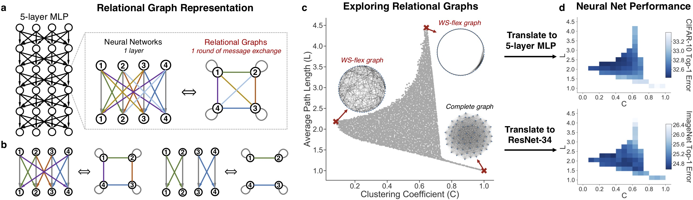
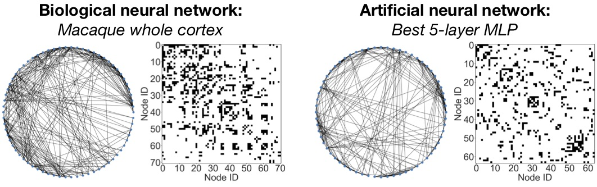

# Graph Structure of Neural Networks

This repository is the official PyTorch implementation of [Graph Structure of Neural Networks](https://arxiv.org/abs/2007.06559), by [Jiaxuan You](https://cs.stanford.edu/~jiaxuan/), [Jure Leskovec](https://cs.stanford.edu/people/jure/index.html), [Kaiming He](http://kaiminghe.com/), [Saining Xie](http://vcl.ucsd.edu/~sxie/), ICML 2020.

The repository is heavily built upon **[pycls](https://github.com/facebookresearch/pycls)**, an image classification codebase built by FAIR.

## Introduction

TLDR: We study the architecture of neural networks through the lens of network science, and discover that *good neural networks are alike* in terms of their underlying graph structure.

We define a novel graph-based representation of neural networks called *relational graph*, as opposed to the commonly used *computational graph*. We then systematically investigate how does the graph structure of neural networks affect their predictive performance. The key finding is that a *sweet spot* of relational graphs have significantly improved predictive performance. We show that the finding is consistent across different tasks and datasets, and the discovered graphs are surprisingly similar to those of real biological neural networks. Please turn to our [paper](https://arxiv.org/abs/2007.06559) for more details.

<div align="center">
  
  <p align="center"><b>Overview of our approach.</b> Diverse neural architectures can be expressed in the language of relational graphs.</p>
</div>

## Code setup


### 1 Installation

**Requirements:**

- NVIDIA GPU, Linux, Python3
- PyTorch, various Python packages; Instructions for installing these dependencies are found below

**Python environment:**
We recommend using Conda package manager

```bash
conda create -n graph2nn python=3.6
conda activate graph2nn
```

**Pytorch:**
Manually install [PyTorch](https://pytorch.org/) with **CUDA** support (CPU version is not supported). 
We have verified under PyTorch 1.4.0 and torchvision 0.5.0. For example:
```bash
pip install torch==1.4.0 torchvision==0.5.0
``` 

**Clone graph2nn repository and install:**

```bash
git clone https://github.com/facebookresearch/graph2nn
cd graph2nn
pip install -r requirements.txt
python setup.py develop
```

### 2 Download datasets

Download [CIFAR-10 dataset](https://www.cs.toronto.edu/~kriz/cifar.html) and/or [ImageNet dataset](http://image-net.org/download).
Uncompress the datasets then link the datasets with our code base.

```bash
# CIFAR-10
mkdir -p pycls/datasets/data
wget https://www.cs.toronto.edu/~kriz/cifar-10-python.tar.gz # or other data directory 
tar -xvf cifar-10-python.tar.gz
DIR=$(readlink -f cifar-10-batches-py)
ln -s $DIR pycls/datasets/data/cifar10 # symlink
# ImageNet (optional)
mkdir -p pycls/datasets/data/imagenet
# Then download ImageNet following their official website
ln -s path/imagenet pycls/datasets/data/imagenet # symlink
```
More details are explained in [DATA.md](docs/DATA.md).

## Run the code

We provide a clean portal for reproducing multiple experimental setups in our paper. 
We have included all the raw experimental results, thus you may directly skip to Step 3 to play with these results.

### 1 Run the best model + baseline model
Running the best discovered model can be as easy as
```bash
# Explaining the arguments:
# Tasks: mlp_cifar10, cnn_imagenet, resnet34_imagenet, resnet34sep_imagenet, resnet50_imagenet, efficient_imagenet, mlp_cifar10_bio
# Division: best, all
# GPU: 1, 8 (for ImageNet experiments only)
bash launch.sh mlp_cifar10 best 1
bash launch.sh resnet34_imagenet best 8
```
### 2 Run a model with a biological neural network structure

Interestingly, we show in our paper that our approach can be used to translate biological neural networks into computable artificial neural networks, under the *message exchange* point of view. Please refer to our paper for more details.

We include an example of translating macaque and cat brain networks to MLP on CIFAR-10

```bash
bash launch.sh mlp_cifar10_bio best 1
```

<div align="center">
  
  <p align="center">Biological neural networks and top artificial neural networks are <b>alike</b>.</p>
</div>

### 3 Run all the models defined by relational graphs

Here is the script for running all the models. Note that this process can be very time consuming, and you make want to use task manager like [slurm](https://slurm.schedmd.com/documentation.html) to carry out these large-scale experiments.
```bash
bash launch.sh mlp_cifar10 all 1
bash launch.sh resnet34_imagenet all 8
```
### 3 Analyzing the results
We provide step-by-step guides for analyzing the raw experimental results. We have included the raw experimental results in our repository. Alternatively, you can redirect the code to your own experimental results.

- [generate_graphs.ipynb](analysis/generate_graphs.ipynb): A demonstration for sweeping the space of relational graphs, using the proposed WS-flex graph generator.
- [analyze_results.ipynb](analysis/analyze_results.ipynb): A comprehensive example for reproducing most of the figures in our paper, such as 
  - Plot 2 graph measures (clustering C, path length L) vs neural network performance
  - Plot 1 graph measures vs neural network performance
  - Determine the "sweet spot"
  - Show the correlation across different models and tasks
  - Show the correlation across different training epochs and different number of relational graphs

```bash
cd analysis/
jupyter notebook
```


## Customize the code

We want to highlight that our methodology is highly general, and we are glad to see if you would like to apply our code in different applications.

### 1 Generate other experimental setups

We generate all the experiment setups using `yaml_gen.py`. For example, to generate configurations for MLP on CIFAR-10:

```bash
python yaml_gen.py --task mlp_cifar10 # MLP on CIFAR-10
```

You can read and edit `yaml_gen.py`, so that you can generate other experimental setups

### 2 Experiment with other relational graphs
We generate relational graphs in `generate_graphs.ipynb`. You can follow the setups there to generate relational graphs with different number of nodes, or different granularity in the space of (clustering C, path length L).

Another fun application will be translating your favorite graph (other bio networks, star graphs, grid graphs, etc.) into MLP or ResNet.
To do this, you can edit `def generate_index` in `pycls/models/relational_graph.py` to include your customized graphs, which should be fair simple.

### 3 Experiment with other image classification models
We implement the base neural architectures, such as MLP, ResNet or EfficientNet, in `pycls/models`. You may follow an example, such as `pycls/models/resnet.py`, to see how a relational graph structure is enforced for a given base architecture. You may try out other neural architectures such as VGG, MobileNets, etc.


### 4 Apply to other application domains

This codebase is primarily built for image classification tasks. However, our proposed *relational graph* representation is general for many other neural networks and application domains. For example, we have tried to apply our approach to Transformer for neural machine translation tasks, and it works reasonably well, using the **[fairseq](https://github.com/pytorch/fairseq)** codebase. 

Here we provide a high-level guideline for this kind of application:

- We implement our relational graph representation in `pycls/models/relational_graph.py`. The key classes to look at are `class TalkLinear` and `class TalkConv2d`, where we show how to enforce a graph structure for linear layer or convolutional layer, via a sparse weight masking. You can follow this technique to transform other neural network layers, if necessary for your application domain, such as recurrent layers, attention layers, etc.
- The relational graphs of interest are provided in `analysis/`, such as `graphs_n64_52.npy` includes 52 relational graphs with 64 nodes, that evenly distribute in the space of (clustering C, path length L).
- You can then apply these modules to your own code repository. Please note that our code base is under **MIT license** and you shall include our license notice if you choose to do so.

## Citing our paper

If you find our paper and/or our codebase useful, please consider cite our paper:

```
@InProceedings{you2020graph,
  title = {Graph Structure of Neural Networks},
  author = {You, Jiaxuan and Leskovec, Jure and He, Kaiming and Xie, Saining},
  booktitle = {ICML},
  year = {2020}
}
```

## License

**graph2nn** is released under the MIT license. Please see the [LICENSE](LICENSE) file for more information.

## Contributing

We actively welcome your pull requests! Please see [`CONTRIBUTING.md`](docs/CONTRIBUTING.md) and [`CODE_OF_CONDUCT.md`](docs/CODE_OF_CONDUCT.md) for more info.
